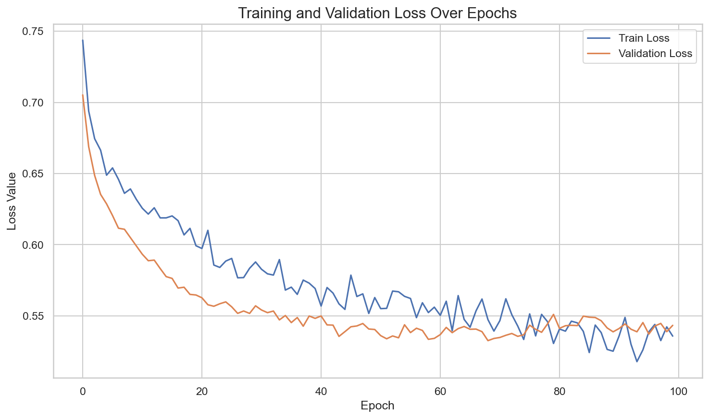
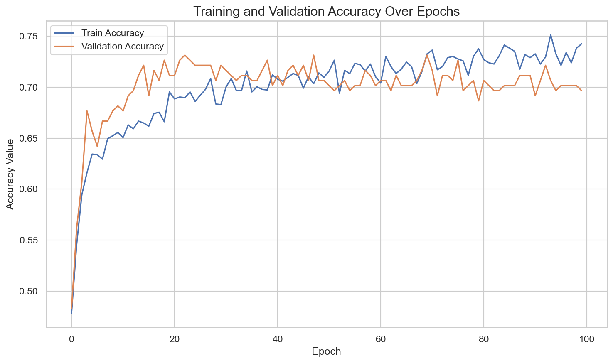

# Water Potability MLP

Binary classification project in PyTorch that predicts whether water is potable based on physicochemical features.

## Tech Stack

- Python 3
- PyTorch, TorchMetrics
- scikit-learn
- pandas, NumPy
- Matplotlib, Seaborn

## Project Structure

```text
water-potability-mlp/
├── config.py
├── train.py
├── evaluate.py
├── data/
├── models/
├── reports/
│   ├── figures/
│   └── metrics.json
├── src/
│   ├── dataset.py
│   ├── model.py
│   ├── reproducibility.py
│   └── utils.py
├── requirements.txt
└── README.md
```

## Methodology

- Stratified train/validation/test split (80/10/10)
- Feature scaling fitted only on the training subset
- Deterministic setup with fixed seed
- Training objective: `BCEWithLogitsLoss`
- Model checkpoint selected by the best validation loss

## Setup

```bash
python3 -m pip install --upgrade pip
python3 -m pip install -r requirements.txt
```

## Training

```bash
python3 train.py
```

The training pipeline is executed through the script entry point (`if __name__ == "__main__":`).

Outputs:

- Best checkpoint: `models/best_net.pth`
- Checkpoint metadata:
  - model weights (`model_state_dict`)
  - optimizer state (`optimizer_state_dict`)
  - epoch of the best checkpoint (`epoch`)
  - best validation loss (`best_val_loss`)
  - scaler statistics (`scaler_mean`, `scaler_scale`)
- Training curves:
  - `reports/figures/loss_curve.png`
  - `reports/figures/accuracy_curve.png`

## Evaluation

```bash
python3 evaluate.py
```

Outputs:

- Test metrics printed in terminal
- Metrics file: `reports/metrics.json`

## Latest Results

Latest run (`seed=42`, `batch_size=64`):

- Test Loss: `0.6157`
- Test Accuracy: `0.7129`
- Best checkpoint epoch: `69`
- Best validation loss at checkpoint: `0.5326`

Artifacts:

- Metrics JSON: `reports/metrics.json`
- Loss curve: `reports/figures/loss_curve.png`
- Accuracy curve: `reports/figures/accuracy_curve.png`




To refresh results and artifacts:

```bash
python3 train.py
python3 evaluate.py
```

## Reproducibility

Core experiment settings are centralized in `config.py`:

- data and model paths
- seed and split ratios
- batch size and number of epochs
- optimizer hyperparameters

## Notes

- Rows with missing values are removed during data loading.
- Evaluation handles both current and legacy checkpoint formats.
